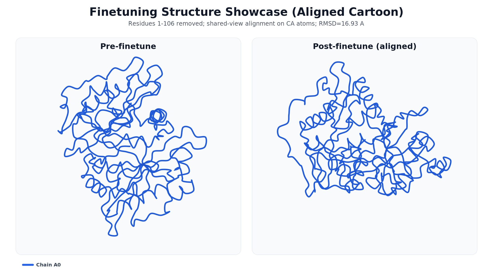

<<<<<<< HEAD
# AF3 Finetuning Guide

This repo is set up for a simple 3-step workflow:

1. Extract screening features with `scripts/predict_binder.sh`
2. Train a confidence classifier with `scripts/train_confidence_classifier.sh`
3. Finetune the full model with `scripts/finetune_classifier.sh`

Run all commands from the repository root.

## Scripts layout

All runnable shell entrypoints are in `scripts/`:

- `scripts/predict_binder.sh`: precompute screening features/labels from input tables.
- `scripts/train_confidence_classifier.sh`: train the MLP confidence classifier from cached `.pt` features.
- `scripts/train_classifier_only.sh`: train classifier directly in one workflow (without separate pre-caching step).
- `scripts/finetune_classifier.sh`: single-GPU/full-model finetuning with classifier-related options.
- `scripts/finetune_classifier_DDP.sh`: multi-GPU (`torchrun`) finetuning variant.
- `scripts/inference_classifier.sh`: run inference with classifier-enabled settings.
- `scripts/get_confidence_and_distance.sh`: compute confidence/distance outputs for analysis.
- `scripts/eval_auc.sh`: evaluate model/classifier performance (AUC pipeline).

## Finetuning showcase: pre vs post structure

Example prediction pair for the same target (`NMT2GNEAALRS`):

- Post-finetune: `output/NMT2GNEAALRS_after_train/seed_101/predictions/NMT2GNEAALRS_after_train_sample_0.cif`
- Pre-finetune: `output/NMT2GNEAALRS_pre_train/seed_101/predictions/NMT2GNEAALRS_pre_train_sample_0.cif`



Detailed vector/PDF version of this figure: [`assets/before_after_finetune.pdf`](assets/before_after_finetune.pdf)

You can open both files in PyMOL/ChimeraX and compare them directly.

Example with PyMOL:

```bash
pymol \
  output/NMT2GNEAALRS_pre_train/seed_101/predictions/NMT2GNEAALRS_pre_train_sample_0.cif \
  output/NMT2GNEAALRS_after_train/seed_101/predictions/NMT2GNEAALRS_after_train_sample_0.cif
```

Then in the PyMOL console:

```text
align NMT2GNEAALRS_after_train_sample_0, NMT2GNEAALRS_pre_train_sample_0
```

This side-by-side cartoon view removes residues `1-106`, aligns post-finetune to pre-finetune, and colors each chain consistently by chain number.

## AF3 finetuning model architecture

Architecture figure (PDF): [`assets/AF3_finetune_model_architecture.pdf`](assets/AF3_finetune_model_architecture.pdf)

## 0) Environment setup

```bash
conda env create -f environment.yml
conda activate protenix
pip install -e .
```

Optional but recommended:

```bash
export LAYERNORM_TYPE=fast_layernorm
```

## 1) Extract features (`scripts/predict_binder.sh`)

Before running, edit `scripts/predict_binder.sh`:

- `checkpoint_path`: path to your base AF3/Protenix checkpoint
- `dump_dir`: output directory for generated tensors/results
- `input_json_paths`: your CSV/JSON input files

Run:

```bash
# default shard (index 0)
bash scripts/predict_binder.sh

# specific shard index (for array jobs)
bash scripts/predict_binder.sh 3
```

Use these outputs to prepare the feature/label tensors consumed in Step 2.

## 2) Train classifier (`scripts/train_confidence_classifier.sh`)

You have two ways to train the classifier:

- **Pre-cached features workflow (recommended for repeated experiments):**
  run `scripts/predict_binder.sh` first to generate features, then train with `scripts/train_confidence_classifier.sh`.
- **Direct workflow:**
  train the classifier directly with `scripts/train_classifier_only.sh`.

Before running, edit `scripts/train_confidence_classifier.sh`:

- `feat_paths`: list of feature `.pt` files from Step 1
- `label_paths`: matching label `.pt` files
- `ligand_length` and training hyperparameters
- `--output`: destination for saved classifier weights

Run:

```bash
bash scripts/train_confidence_classifier.sh
```

Keep the final classifier checkpoint path from `--output`. You will load this in Step 3.

Alternatively, for direct classifier training without separately pre-caching features:

```bash
bash scripts/train_classifier_only.sh
```

## 3) Finetune full model (`scripts/finetune_classifier.sh`)

Before running, edit `scripts/finetune_classifier.sh`:

- `checkpoint_path`: base checkpoint to finetune from
- `--load_checkpoint_path ${checkpoint_path}`
- `--load_ema_checkpoint_path ${checkpoint_path}`
- `--load_classifier_checkpoint true`
- `--load_checkpoint_path_classifier /path/to/classifier_from_step2.pt`
- any training knobs you want (`--run_name`, `--max_steps`, `--lr`, dataset args, etc.)

Run:

```bash
bash scripts/finetune_classifier.sh
```

## End-to-end commands

Pre-cached features workflow:

```bash
# 1) feature extraction
bash scripts/predict_binder.sh

# 2) classifier training
bash scripts/train_confidence_classifier.sh

# 3) full-model finetuning
bash scripts/finetune_classifier.sh
```

Direct classifier-training workflow:

```bash
# train classifier directly
bash scripts/train_classifier_only.sh
```

## Troubleshooting

- `scripts/predict_binder.sh` calls `runner/pedict_binder.py` (filename is `pedict_binder.py`).
- For multi-GPU finetuning, use `scripts/finetune_classifier_DDP.sh` with the same classifier-loading flags.
- If Step 2 fails on missing files, verify `feat_paths` and `label_paths` are paired and valid.
=======
# AF3 Finetune

[](https://opensource.org/licenses/Apache-2.0)
[](https://www.python.org/downloads/)
[](https://pytorch.org/)

This repository provides an optimized pipeline for fine-tuning AlphaFold 3 (AF3) architectures on custom biomolecular datasets. Built upon ByteDance's open-source [Protenix](https://github.com/bytedance/Protenix) implementation, this standalone toolkit is designed to adapt AF3 for specialized structural biology tasks, such as predicting enzyme-substrate interactions, modeling non-canonical protein recognition, and exploring specific protein-ligand interfaces.

## 🌟 Key Features
- **Diffusion-based Finetuning:** Leverage the AF3 diffusion module to refine complex structure predictions.
- **Custom Data Pipelines:** Streamlined scripts to process mmCIF/PDB files and MSAs for custom training regimens.
- **All-Atom Support:** Handles proteins, DNA, RNA, and small molecules (ligands).
- **Optimized Configurations:** Pre-set YAML configs tailored for low-learning-rate finetuning and confidence score extraction.

---

## ⚙️ Installation

To get started, clone the repository and set up the environment:

```bash
# Clone the repository
git clone [https://github.com/wenzhe-chen/AF3_finetune.git](https://github.com/wenzhe-chen/AF3_finetune.git)
cd AF3_finetune

# Create environment (Mamba/Conda recommended)
conda create -n protenix python=3.10 -y
conda activate protenix

# Install dependencies
pip install -r requirements.txt
>>>>>>> origin/AF3_finetune
